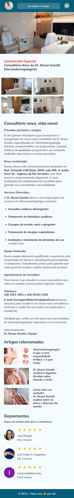

# Landing Page Dr. Bruno Goretti

## Meu primeiro projeto profissional 🚀

👩🏽‍💻 Acesse o link do projeto em **About**

## 🔰 Tecnologias

- HTML
- CSS
- Git

## 💡 Meu Projeto

Esse projeto foi um presente que fiz como agradecimento pelo trabalho do Dr. Bruno Goretti. Construí a Landing Page com HTML e CSS (puros) em Mobile First, e tive como referência de criação o Blog dos Gatos design feito no Figma por [Daniel Duarte](https://www.instagram.com/odaniel2d/). Alguns detalhes de estilização precisam ser ajustados, mas a ideia principal foi atingida.

## Design no Figma
[Blog dos Gatos](https://www.figma.com/file/8XJT5AflfdjdeqIy82ArpX/Blog-de-Gatos-%E2%80%A2-Desafio-Explorer-(Community)?type=design&node-id=101-91&mode=design&t=FtDiQn41mnpNFCw6-0)

## 🤸🏽‍♂️ Contato

[Meu LinkedIn](https://www.linkedin.com/in/gkos22/)